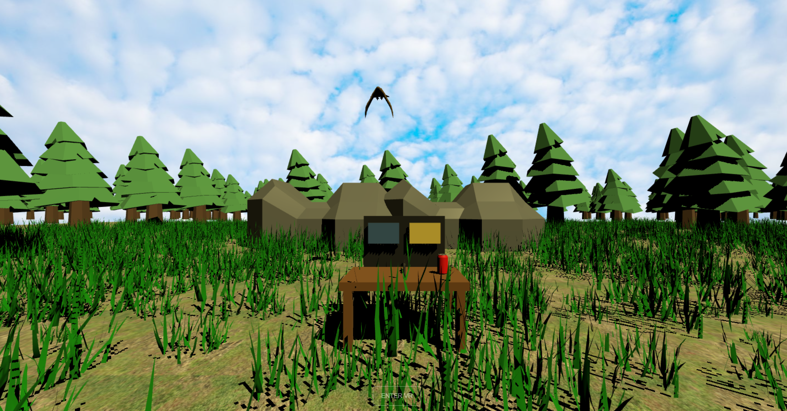
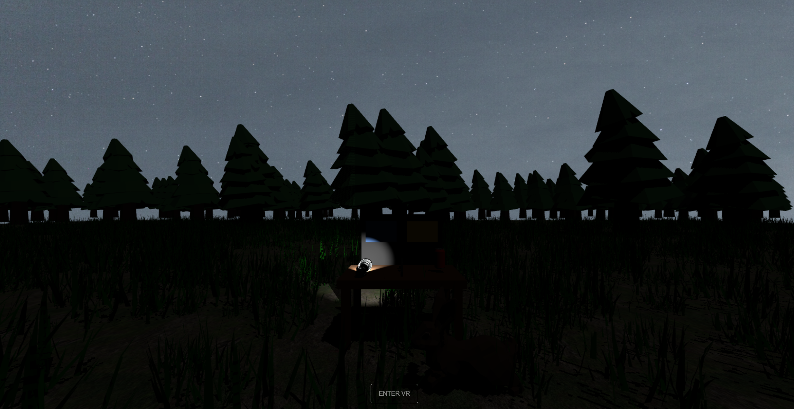

# Práctica Extendida – Escena VR Día / Noche con Three.js

Este proyecto es una **extensión de la práctica base** realizada con **Three.js y WebXR**, donde se ha ampliado la funcionalidad tanto a nivel visual como estructural, incorporando un segundo nivel jugable.

---

### Modo Día


### Modo Noche



## Características principales añadidas

### 1️⃣ Reestructuración del código
Se ha realizado una **reorganización completa del proyecto**, separando responsabilidades en distintos módulos:

- `main.js`: gestión global de niveles y cambio de modo.
- `dayLevel.js` / `nightLevel.js`: lógica independiente para cada nivel.
- `controls.js`: gestión de controladores VR y estado de interacción.
- `elements.js`: creación de elementos reutilizables (suelo, mesa, paneles, luces, etc.).

Esto mejora la **legibilidad**, el **mantenimiento** y evita duplicación de código.

---

### 2️⃣ Añadido de césped
Se ha incorporado **vegetación distribuida aleatoriamente** por el escenario mediante instancias de modelos 3D, dando mayor realismo y profundidad visual al entorno.

---

### 3️⃣ Iluminación avanzada: sol y luna
Se han añadido dos tipos de iluminación direccional:

- **Sol (modo día)**
- **Luna (modo noche)**

Ambos utilizan **luces direccionales con sombras activadas**, permitiendo que los objetos proyecten sombras realistas y diferenciando claramente el ambiente entre día y noche.

---

### 4️⃣ Nuevo nivel: Modo Noche
Se ha creado un **segundo nivel jugable** accesible desde el propio escenario:

- En el modo noche aparecen **conejos de forma periódica**.
- Los conejos se desplazan por el escenario.
- El objetivo es **dispararles con la escopeta**.
- Hay que usar la linterna para poder verlos

---

### 5️⃣ Cambio de nivel mediante interacción VR
El cambio entre **modo día y modo noche** se realiza **disparando a un panel** situado sobre la mesa:

- El panel tiene dos zonas:
  - Día
  - Noche
- Al disparar a cada zona, el juego cambia de nivel.

---

### 6️⃣ Linterna interactiva
En el modo noche se ha añadido una **linterna**:

- Puede cogerse con la mano en VR.
- Se **enciende y apaga pulsando el gatillo** del controlador.
- Utiliza una **luz tipo Spotlight** para iluminar el entorno oscuro.

---

## Controles principales

- **Gatillo**:
  - Disparar con la escopeta
  - Encender / apagar la linterna
- **Agarre**:
  - Coger y soltar objetos
- **Movimiento**:
  - Joystick del controlador izquierdo
- **Cambio de modo**:
  - Disparando al panel Día / Noche

---


## Cómo probar el proyecto

### Requisitos
- **Node.js** (versión 18 o superior recomendada)
- Navegador compatible con **WebXR**  
  - Chrome / Edge  
  - Para PC sin visor VR: usar **Immersive Web Emulator**

---

### Instalación
Desde la carpeta del proyecto:

```bash
npm install
```

---

### Ejecutar en modo desarrollo
```bash
npm run dev
```

Después abre en el navegador la URL que muestra la terminal (normalmente):

```
http://localhost:5173
```